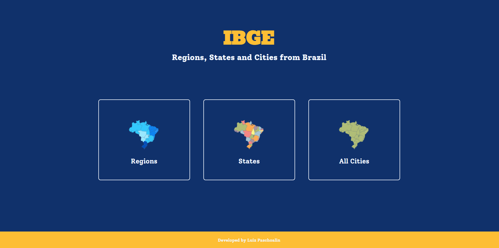

<a name="top"></a>
<!-- PROJECT SHIELDS -->
<!--
*** I'm using markdown "reference style" links for readability.
*** Reference links are enclosed in brackets [ ] instead of parentheses ( ).
*** See the bottom of this document for the declaration of the reference variables
*** for contributors-url, forks-url, etc. This is an optional, concise syntax you may use.
*** https://www.markdownguide.org/basic-syntax/#reference-style-links
-->
[![Contributors][contributors-shield]][contributors-url]
[![Forks][forks-shield]][forks-url]
[![Stargazers][stars-shield]][stars-url]
[![Issues][issues-shield]][issues-url]
[![LinkedIn][linkedin-shield]][linkedin-url]


<!-- PROJECT LOGO -->
<br />
<div align="center">
  <a href="https://github.com/LuizPaschoalin/Portifolio_Social_Media">
    
  </a>

<h3 align="center">Portfolio IBGE</h3>

  <p align="center">
A simple website that show all Regions, States and cities from Brazil
    <br />
    <a href="https://github.com/LuizPaschoalin/Portifolio_Social_Media"><strong>Explore the docs »</strong></a>
    <br />
    <br />
    <a href="https://github.com/LuizPaschoalin/Portifolio_Social_Media">View Demo</a>
    ·
    <a href="https://github.com/LuizPaschoalin/Portifolio_Social_Media/issues">Report Bug</a>
    ·
    <a href="https://github.com/LuizPaschoalin/Portifolio_Social_Media/issues">Request Feature</a>
  </p>
</div>

<!-- ABOUT THE PROJECT -->
## About The Project



![netlify][netlify.io] ```portfolio-ibge.netlify.app```

This is a project where shows all the cities, regions and states from Brazil, i made it quickly simple, using only HTML, CSS and a little bit of js.
The API used was from IBGE and you can check it at the website "https://servicodados.ibge.gov.br/api/docs/localidades#api-Municipios-estadosUFMunicipiosGet"


### Built With

* [![HTML][html.io]][html-url]
* [![css][css.io]][css-url]
* [![js][js.io]][js-url]


<!-- CONTACT -->
## Contact

Luiz Paschoalin -  luiz.razer@hotmail.com
instagram - @luizpaschoalin


<!-- MARKDOWN LINKS & IMAGES -->
<!-- https://www.markdownguide.org/basic-syntax/#reference-style-links -->
[contributors-shield]: https://img.shields.io/github/contributors/LuizPaschoalin/Portfolio-IBGE.svg?style=for-the-badge
[contributors-url]: https://github.com/LuizPaschoalin/Portfolio-IBGE/graphs/contributors
[forks-shield]: https://img.shields.io/github/forks/LuizPaschoalin/Portfolio-IBGE.svg?style=for-the-badge
[forks-url]: https://github.com/LuizPaschoalin/Portfolio-IBGE/network/members
[stars-shield]: https://img.shields.io/github/stars/LuizPaschoalin/Portfolio-IBGE.svg?style=for-the-badge
[stars-url]: https://github.com/LuizPaschoalin/Portfolio-IBGE/stargazers
[issues-shield]: https://img.shields.io/github/issues/LuizPaschoalin/Portfolio-IBGE.svg?style=for-the-badge
[issues-url]:https://github.com/LuizPaschoalin/Portfolio-IBGE/issues
[linkedin-shield]: https://img.shields.io/badge/-LinkedIn-black.svg?style=for-the-badge&logo=linkedin&colorB=555
[linkedin-url]: https://www.linkedin.com/in/luiz-antonio-paschoalin/
[html.io]: https://img.shields.io/badge/HTML-239120?style=for-the-badge&logo=html5&logoColor=white
[html-url]: https://www.w3schools.com/html/
[css.io]: https://img.shields.io/badge/CSS-239120?&style=for-the-badge&logo=css3&logoColor=white
[css-url]: https://www.w3schools.com/css/
[js.io]: https://shields.io/badge/JavaScript-F7DF1E?logo=JavaScript&logoColor=000&style=flat-square
[js-url]: https://www.javascript.com
[netlify.io]: https://img.shields.io/badge/Hosted%20Website%20Link-blue
[netlify-url]: portifolio-social-media.netlify.app
